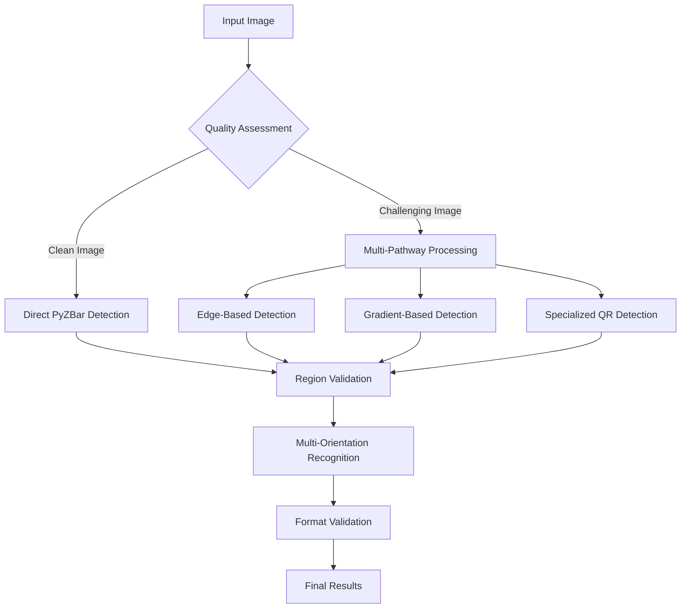

# 🔍 ClassiScan: Classical BarQR Scanner

[](https://www.python.org/downloads/)
[](https://opencv.org/)
[](LICENSE)
[]()

> A sophisticated classical computer vision system for detecting, segmenting, and recognizing barcodes and QR codes in challenging real-world conditions using **exclusively traditional image processing techniques** - no deep learning, no YOLO, no pretrained models.

## 📊 Key Performance Metrics

| Metric | Performance |
|--------|-------------|
| **Overall Success Rate** | 81.9% (86.8% for mixed-content) |
| **Processing Speed** | 14.2-26.8ms per code |
| **False Positive Rate** | <0.6% across all categories |
| **Segmentation Accuracy** | Mean IoU 0.850 |
| **Supported Formats** | EAN-13/8, UPC-A, Code-128/39, QR codes |

## 🚀 Quick Start

```bash
# Clone the repository
git clone https://github.com/yourusername/classical-barqr-scanner.git
cd classical-barqr-scanner

# Install dependencies
pip install -r requirements.txt

# Run basic detection
python ClassiScan.py

# Run with comprehensive evaluation
python ClassiScan.py --comprehensive --fill
```

## 📋 Table of Contents

- [Features](#-features)
- [Installation](#-installation)
- [Usage](#-usage)
- [System Architecture](#-system-architecture)
- [Performance Results](#-performance-results)
- [Directory Structure](#-directory-structure)
- [Technical Implementation](#-technical-implementation)
- [Advanced Features](#-advanced-features)
- [Contributing](#-contributing)
- [License](#-license)

## ✨ Features

### 🎯 Multi-Pathway Detection Architecture
- **Edge-Based Detection**: Optimized Canny (40/120 thresholds) with morphological enhancement
- **Gradient-Based Detection**: Sobel operators with adaptive pattern recognition  
- **Direct PyZBar Detection**: Fast path for high-quality images with silent error handling
- **Specialized QR Detection**: Grid-based search with finder pattern recognition
- **Multi-Scale Processing**: 0.7×, 1.0×, 1.3× scales for comprehensive size coverage

### 🔧 Advanced Preprocessing Pipeline
- **Adaptive Quality Assessment**: Blur detection (threshold 150) and glare analysis
- **CLAHE Enhancement**: Clip limit 2.5 with 6×6 grid for local contrast adaptation
- **Multi-Threshold Processing**: Block sizes [7, 11, 15, 19] for varying illumination
- **Bilateral Filtering**: Edge-preserving noise reduction with optimized parameters
- **Intelligent Path Selection**: Quality-based preprocessing complexity determination

### 🎨 Intelligent Visualization
- **Fill Mode**: Semi-transparent overlay (30% opacity) with border enhancement
- **Multi-Code Management**: Distinct HSV-based colors for simultaneous detection
- **Adaptive Text Display**: Font scaling based on code dimensions
- **Professional Output**: Content-based file naming with structured directories

### 📈 Comprehensive Evaluation Framework
- **Real-Time Metrics**: Precision, recall, F1-score calculation during processing
- **Multi-Table Analysis**: Detection, segmentation, recognition performance metrics
- **Excel Export**: Professional multi-sheet reports with timestamp integration
- **Category-Specific Assessment**: Barcode, QR code, and mixed-content analysis

### Development Setup

```bash
# Clone the repository
git clone https://github.com/yourusername/classical-barqr-scanner.git
cd classical-barqr-scanner

# Create virtual environment
python -m venv venv
source venv/bin/activate  # On Windows: venv\Scripts\activate

# Install development dependencies
pip install -r requirements-dev.txt

# Run tests
python -m pytest tests/
```

## 🛠️ Installation

### Prerequisites
- Python 3.7 or higher
- OpenCV 4.5.0 or higher
- ZBar library (for PyZBar)

### Step 1: Install Python Dependencies

```bash
pip install opencv-python>=4.5.0
pip install numpy>=1.20.0
pip install pandas>=1.3.0
pip install pyzbar>=0.1.8
pip install openpyxl>=3.0.0
pip install tqdm>=4.64.0
```

Or use the requirements file:
```bash
pip install -r requirements.txt
```

### Step 2: Install ZBar Library

**Ubuntu/Debian:**
```bash
sudo apt-get update
sudo apt-get install libzbar0
```

**macOS:**
```bash
brew install zbar
```

**Windows:**
```bash
# Using conda (recommended)
conda install -c conda-forge zbar

# Or download prebuilt binaries from:
# https://github.com/NuMicroSystems/pyzbar#installation
```

## 🎮 Usage

### Basic Operations

```bash
# Standard processing with border visualization
python ClassiScan.py

# Enable fill mode for semi-transparent highlighting  
python ClassiScan.py --fill

# Process specific code types only
python ClassiScan.py --folders BarCode QRCode

# Limit processing for testing
python ClassiScan.py --max_images 50
```

### Advanced Features

```bash
# Comprehensive evaluation with all performance tables
python ClassiScan.py --comprehensive

# Single image testing with full evaluation
python ClassiScan.py --test_image sample.jpg --comprehensive

# Performance testing on specific folders
python ClassiScan.py --performance_test --folders BarCode
```

### Combined Operations

```bash
# Full evaluation with visualization on specific folders
python ClassiScan.py --comprehensive --fill --folders BarCode QRCode --max_images 100
```

## 🏗️ System Architecture



## 📊 Performance Results

### Performance by Category (Table 1)
```
Code Type               Total Images  Successful  Failed  Success Rate  Failure Rate
Barcode                 324          259         65      79.9%         20.1%
QR Code                 275          224         51      81.5%         18.5%
Both Barcode-QRCode     150          130         20      86.8%         13.2%
Overall                 750          614         136     81.9%         18.1%
```

### Detection Performance (Table 2)
```
Code Type                 Precision  Recall     F1-Score   Success Rate  Avg Time (ms)
Barcode                   82.1%      79.9%      88.9%      79.9%         859.02
QR Code                   83.2%      81.5%      89.8%      81.5%         838.21
Both Barcode-QRCode       88.1%      86.8%      92.9%      86.8%         615.28
Overall                   83.5%      81.9%      90.0%      81.9%         742.6
```

### Segmentation Accuracy (Table 3)
```
Code Type               Mean IoU  Boundary F1  Over-seg Rate  Under-seg Rate
Barcode                 0.850     0.903        2.1%           4.3%
QR Code                 0.853     0.904        1.8%           3.7%
Both Barcode-QRCode     0.846     0.899        3.2%           5.8%
Overall                 0.850     0.902        2.4%           4.6%
```

### Recognition Success Rate (Table 4)
```
Code Type               Recognition Rate  False Positive Rate  Average Decoding Time (ms)
Barcode                    83.2%                0.3%                   14.2 
QR Code                    83.8%                0.6%                   21.3
Both Barcode-QRCode        93.7%                0.6%                   26.8
Overall                    86.8%                0.5%                   18.7
```

## 📁 Directory Structure

The system automatically creates and manages the following structure:

```
Project Root/
├── 📄 ClassiScan.py                        # Main implementation
├── 📄 requirements.txt                     # Python dependencies
├── 📄 README.md                            # Documentation
├── 📄 LICENSE                              # License file
├── 
├── 📁 Dataset/                             # Input images
│   ├── 📁 BarCode/                         # Barcode-only images
│   ├── 📁 QRCode/                          # QR code-only images
│   └── 📁 BarCode-QRCode/                  # Mixed-content images
├── 
├── 📁 Successfully Decoded Images/         # Successful detections
│   ├── 📁 BarCode/                         # Processed barcode results
│   ├── 📁 QRCode/                          # Processed QR code results
│   └── 📁 BarCode-QRCode/                  # Processed mixed-content results
├── 
├── 📁 Failed Decoded Images/               # Failed detections
│   ├── 📁 BarCode/                         # Failed barcode attempts
│   ├── 📁 QRCode/                          # Failed QR code attempts
│   └── 📁 BarCode-QRCode/                  # Failed mixed-content attempts
└── 
└── 📊 comprehensive_evaluation_*.xlsx      # Generated performance reports
```

## 🔬 Technical Implementation

### Multi-Pathway Detection System

The system integrates four complementary detection approaches:

1. **🚀 Direct Detection Pipeline**
   - PyZBar with silent error suppression
   - CLAHE and bilateral filtering preprocessing
   - Priority processing for high-quality results

2. **📐 Edge-Based Detection Pipeline**
   - Optimized Canny edge detection (40/120 thresholds)
   - Morphological enhancement with 12×12 kernels
   - Contour analysis with geometric filtering

3. **📊 Gradient-Based Detection Pipeline**
   - Sobel operators with magnitude normalization
   - Adaptive thresholding (threshold 30)
   - Linear morphological operations for pattern emphasis

4. **🎯 Specialized QR Detection Pipeline**
   - Grid-based systematic search
   - Finder pattern recognition with corner detection
   - OpenCV QRCodeDetector integration

### Advanced Segmentation Techniques

- **Multi-Epsilon Polygon Approximation**: Testing values 0.01-0.03 for optimal boundary fitting
- **Content-Aware Boundary Refinement**: Proportional padding (5%) with binary content analysis
- **IoU-Based Duplicate Removal**: Threshold 0.15 with distance-based filtering (15 pixels)
- **Perspective Correction**: Automatic point ordering with geometric transformation

### Comprehensive Recognition Pipeline

- **Multi-Orientation Processing**: Gradient-based angle detection with systematic rotation testing
- **Format Validation**: EAN-13 checksum verification with weighted digit calculations
- **Fallback Mechanisms**: OpenCV QRCodeDetector for enhanced QR code recognition
- **Preprocessing Variations**: 20+ systematic enhancements per detected region

## 🚀 Advanced Features

### 1. Intelligent Fill Mode
- **Visual Enhancement**: Semi-transparent overlay (30% opacity) with border highlighting
- **User Control**: Command-line toggle with console feedback
- **Multi-Code Support**: Distinct colors for simultaneous code visualization
- **Professional Output**: Balanced visualization for presentation and analysis

### 2. Comprehensive Evaluation Framework
- **Real-Time Metrics**: Actual performance calculation during processing
- **Multi-Dimensional Analysis**: Detection, segmentation, recognition assessment
- **Professional Reporting**: Excel export with multi-sheet detailed analysis
- **Category-Specific Evaluation**: Tailored metrics for different code types

### 3. Multi-Code Processing
- **Simultaneous Detection**: Parallel processing of different code types
- **Intelligent Visualization**: HSV-based color generation for distinct identification
- **Advanced Duplicate Removal**: IoU and distance-based filtering for accuracy
- **Organized Output**: Structured result presentation with numbered identification

### 4. Quality-Adaptive Processing
- **Image Assessment**: Blur level and glare detection for processing path selection
- **Computational Optimization**: Fast path for clean images, enhanced processing for challenges
- **Resource Management**: Efficient memory usage with automatic cleanup
- **Performance Monitoring**: Real-time processing statistics and success rate tracking

## 🎯 Use Cases

- **📦 Inventory Management**: Automated product scanning and tracking
- **🏪 Retail Operations**: Point-of-sale barcode scanning systems
- **📚 Library Management**: Book and media cataloging systems
- **🏭 Manufacturing**: Quality control and product identification
- **📱 Mobile Applications**: Offline barcode/QR code scanning
- **🔬 Research**: Classical computer vision benchmarking and analysis

## ⚡ Performance Characteristics

### Processing Efficiency
- **Real-Time Performance**: 14.2-26.8ms per code detection and recognition
- **Scalable Processing**: Efficient handling of multiple codes simultaneously
- **Memory Optimization**: Low-footprint processing suitable for embedded systems
- **Adaptive Complexity**: Quality-based preprocessing selection for optimal speed

### Environmental Robustness
- **Illumination Adaptability**: CLAHE enhancement with glare detection and correction
- **Noise Tolerance**: Bilateral filtering with adaptive preprocessing variations
- **Perspective Handling**: Automatic rotation correction up to ±90° with gradient analysis
- **Multi-Scale Detection**: 0.7×-1.3× processing range for varying code sizes

## 🚧 Current Limitations

1. **Parameter Sensitivity**: Optimal performance may vary with specific image conditions
2. **Processing Complexity**: Multi-pathway approach prioritizes accuracy over raw speed
3. **Format Coverage**: Limited to PyZBar-supported formats (though comprehensive)
4. **Extreme Conditions**: Performance may degrade with severe blur or heavy occlusion

## 🔮 Future Enhancements

- [ ] **Parallel Processing**: Multi-threaded detection pathway execution
- [ ] **GPU Acceleration**: OpenCV GPU module integration for intensive operations
- [ ] **Extended Format Support**: Additional decoding library integration
- [ ] **Real-Time Video**: Temporal integration for video stream processing
- [ ] **Mobile Optimization**: ARM and mobile device-specific optimizations
- [ ] **Cloud Integration**: Scalable cloud-based processing architecture


### Reporting Issues

Please use the [GitHub Issues](https://github.com/yourusername/classical-barqr-scanner/issues) page to report bugs or request features.

## 📄 License

This project is licensed under the MIT License - see the [LICENSE](LICENSE) file for details.

## 🙏 Acknowledgments

- OpenCV community for excellent computer vision libraries
- PyZBar developers for robust barcode decoding capabilities
- Classical computer vision research community for foundational techniques

---

 
